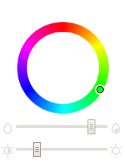

# Vue_ColorCircle
VUE色彩环选择器



基于 [vue2](https://github.com/vuejs/vue)

## 使用
```
<Colorcircle @change="handelChange"/>
```
绑定响应函数，返回16进制颜色值，比如 '#FFFFFF'

## 感谢
* 取色算法代码实现源自jQuery插件Farbtastic https://acko.net/blog/farbtastic-jquery-color-picker-plug-in/
* ICON来自阿里矢量图库 https://www.iconfont.cn/